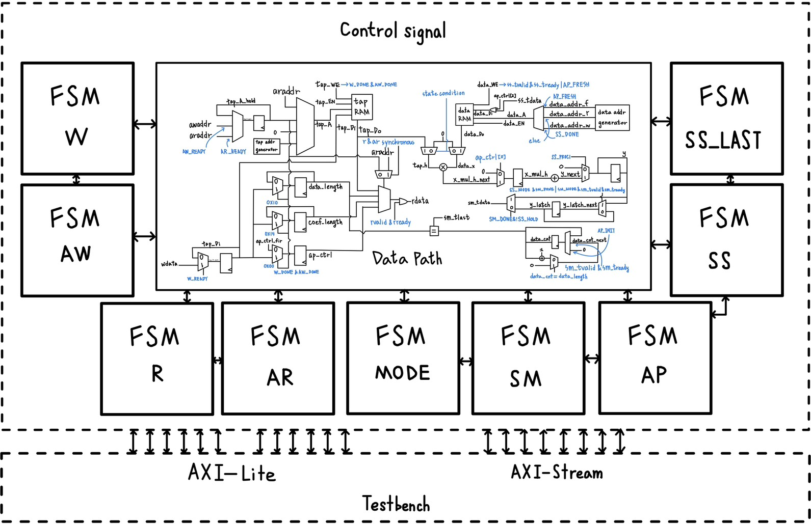

# Spring Lab3: FIR Design
## Introduction
In this Lab, we need to implement finite impulse response. 
```math 
y[n] = \sum_{i=1}^{N} h[i]x[n-i]
```
We have three-part, `tap_RAM`, `data_RAM` and `fir`. The `testbench` communicates with the `fir` by **Advanced eXtensible Interface(AXI Lite and AXI Stream)**. AXI Lite will be used to access `tap_RAM` and `configuration register` in `fir`. AXI Stream will be used to access `data_RAM` and output the calculation result of `fir` to the `testbench`.

The data path of my design is shown in the following figure, and FSM determines the control signal.



## Report
https://hackmd.io/@VYAZ71eHRa2w0l_K52GM0g/Bk8MYys3kg
## Error correction 
https://hackmd.io/@VYAZ71eHRa2w0l_K52GM0g/SJPAovHnkl
