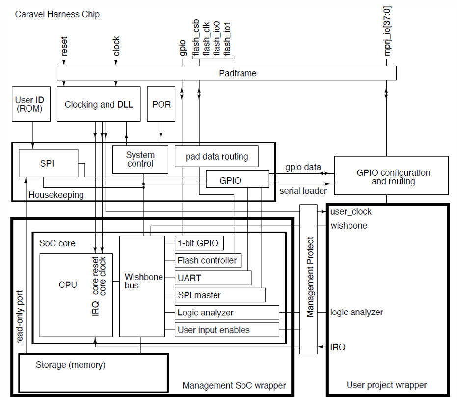

# Spring Lab4: Caravel SoC 
## Introduction
In this lab, we put the FIR designed in lab3 into the user area of caravel soc. The firmware code `fir_control.c` is used to program the `fir`, when doing the write operation in firmware code, RISC-V CPU will send signal to the wishbone bus, then the user area will decode the wishbone signal and convert it to corresponding axi signal, sending into `fir`. The output of `fir` will be read by cpu and display on the mprj pins `checkbits`.

## Report
